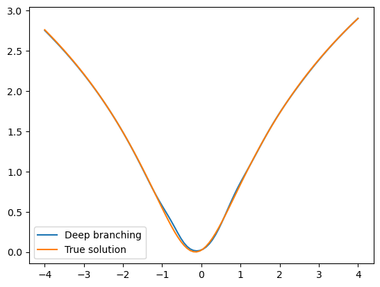

# Deep branching solver in PyTorch
Authors: Jiang Yu Nguwi and Nicolas Privault.

If this code is used for research purposes, please cite as \
J.Y. Nguwi, G. Penent, and N. Privault.
A deep branching solver for fully nonlinear partial differential equations.
*arXiv preprint arXiv:2203.03234*, 2022.
<br/><br/>

Deep branching solver based on [[NPP22]](#nguwi2022deepbranching)
aims to solve
fully nonlinear PDEs of the form\
\
with\


We present the use of the deep branching solver
with the particular example of


&nbsp; and &nbsp;


This example admits the true PDE solution of\


For illustration purposes,
suppose that we are only interested in the solution u(0, x) for


## Using deep branching solver
There are two ways to utilize the deep branching solver:
1. Edit the templates inside the `__main__` environment
        in `branch.py`, then run `python branch.py` from your terminal.
2. Write your own code and import the solver to your code via `from branch import Net`,
        see the sections [defining the derivatives map and the functions](#defining-the-derivatives-map-and-the-functions)
        and [training the model](#training-the-model).

## Defining the derivatives map and the functions
Functions f and g must be written in the PyTorch framework, e.g.
```python
import torch
import numpy as np

device = torch.device("cuda" if torch.cuda.is_available() else "cpu")
T, x_lo, x_hi, dim = .05, -4.0, 4.0, 3
# deriv_map is n x d array defining lambda_1, ..., lambda_n
deriv_map = np.array(
    [
        [0, 0, 0],
        [1, 0, 0],
        [0, 1, 0],
        [0, 0, 1],
    ]
)

def f_fun(y):
    """
    idx 0      -> no deriv
    idx 1 to d -> first deriv
    """
    return y[1:].sum(dim=0) + dim * torch.exp(-y[0]) * (1 - 2 * torch.exp(-y[0]))

def g_fun(x):
    return torch.log(1 + x.sum(dim=0) ** 2)
```

## Training the model
Next, we are ready to initialize the model and to train it.
After the training,
we plot the graph comparing
deep branching solution and the true solution.
```python
from branch import Net
import matplotlib.pyplot as plt

# initialize model and training
model = Net(
    deriv_map=deriv_map,
    f_fun=f_fun,
    phi_fun=g_fun,
    T=T,
    x_lo=x_lo,
    x_hi=x_hi,
    device=device,
    verbose=True,
)
model.train_and_eval()


# define exact solution and plot the graph
def exact_fun(t, x, T):
    return np.log(1 + (x.sum(axis=0) + dim * (T - t)) ** 2)

grid = torch.linspace(x_lo, x_hi, 100).unsqueeze(dim=-1)
nn_input = torch.cat((torch.zeros((100, 1)), grid, torch.zeros((100, 2))), dim=-1)
plt.plot(grid, model(nn_input).detach(), label="Deep branching")
plt.plot(grid, exact_fun(0, nn_input[:, 1:].numpy().T, T), label="True solution")
plt.legend()
plt.show()
```
The resulting plot is embedded below:\


## Comparison with other deep solver
The deep branching solver can be compared with
other deep learning solvers such as
the deep BSDE method [[HJE18]](#han2018solving) and
the deep Galerkin method [[SS18]](#sirignano2018dgm).
The codes are available in
`bsde.py` and `galerkin.py`.

In the `comparison.ipynb` notebook,
we present such comparisons using
five PDE examples
considered in [[NPP22]](#nguwi2022deepbranching).

## References
<a id="han2018solving">[HJE18]</a>
J. Han, A. Jentzen, and W. E.
Solving high-dimensional partial differential equations using deep
learning.
*Proceedings of the National Academy of Sciences*,
115(34):8505--8510, 2018.

<a id="nguwi2022deepbranching">[NPP22]</a>
J.Y. Nguwi, G. Penent, and N. Privault.
A deep branching solver for fully nonlinear partial differential equations.
*arXiv preprint arXiv:2203.03234*, 2022.

<a id="sirignano2018dgm">[SS18]</a>
J. Sirignano and K. Spiliopoulos.
DGM: A deep learning algorithm for solving partial differential
equations.
*Journal of computational physics*,
375:1339--1364, 2018.
